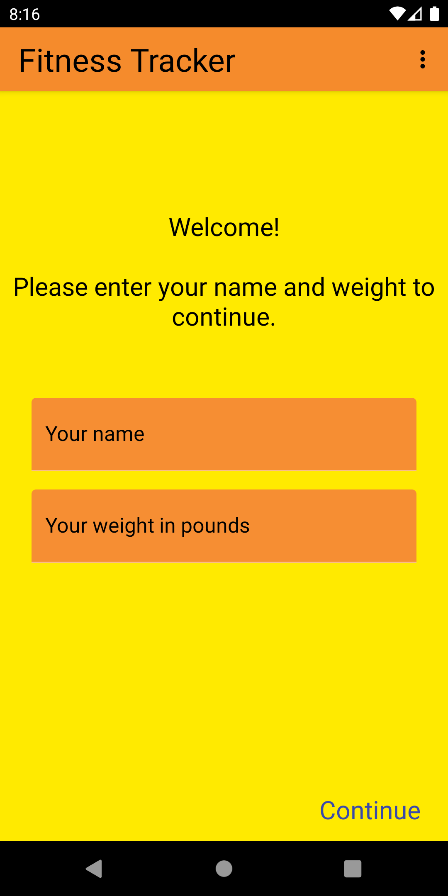
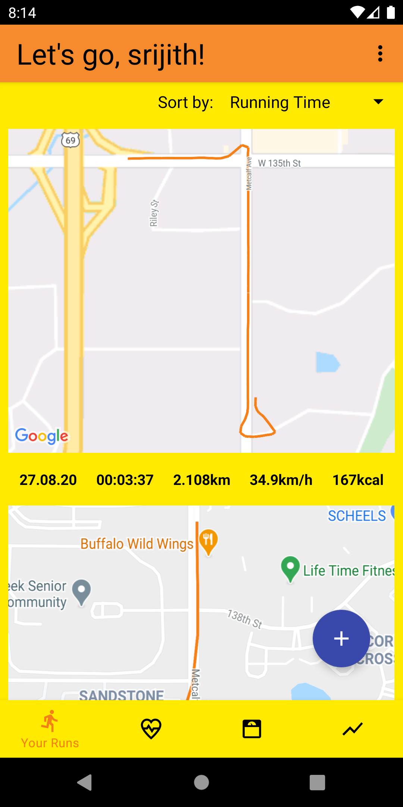
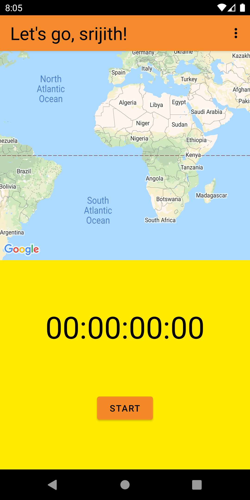
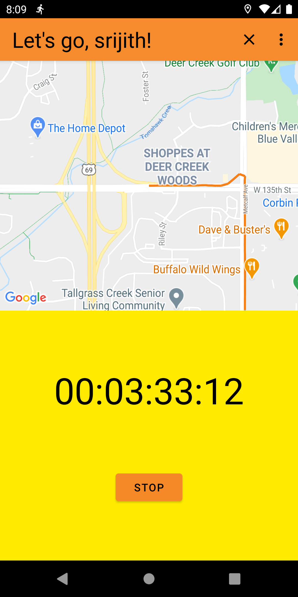
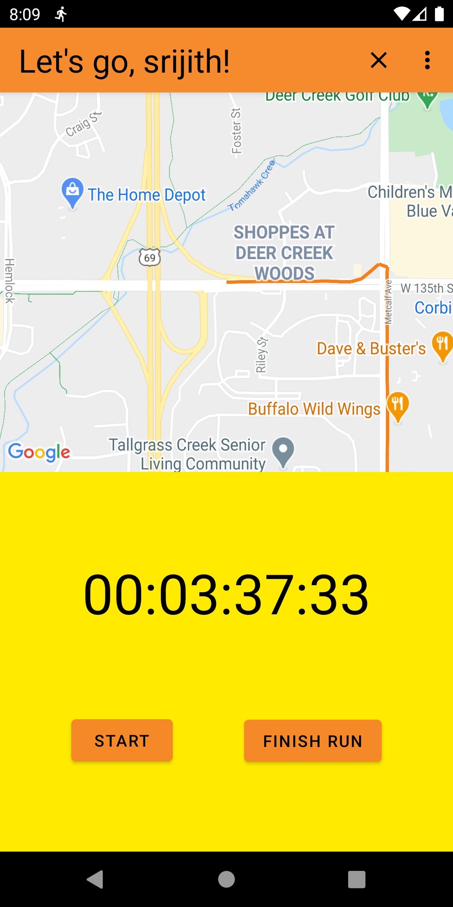
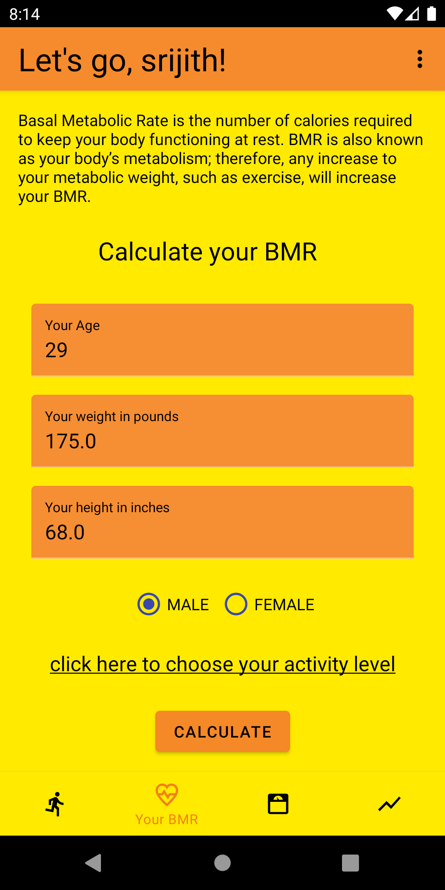
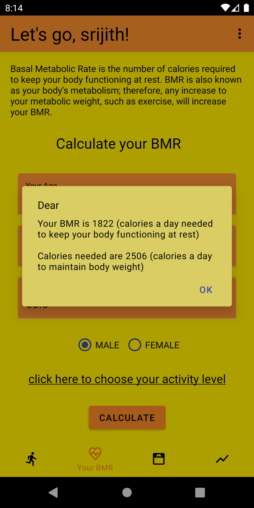
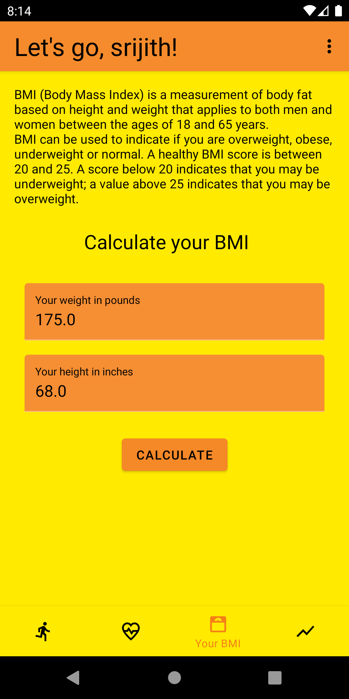
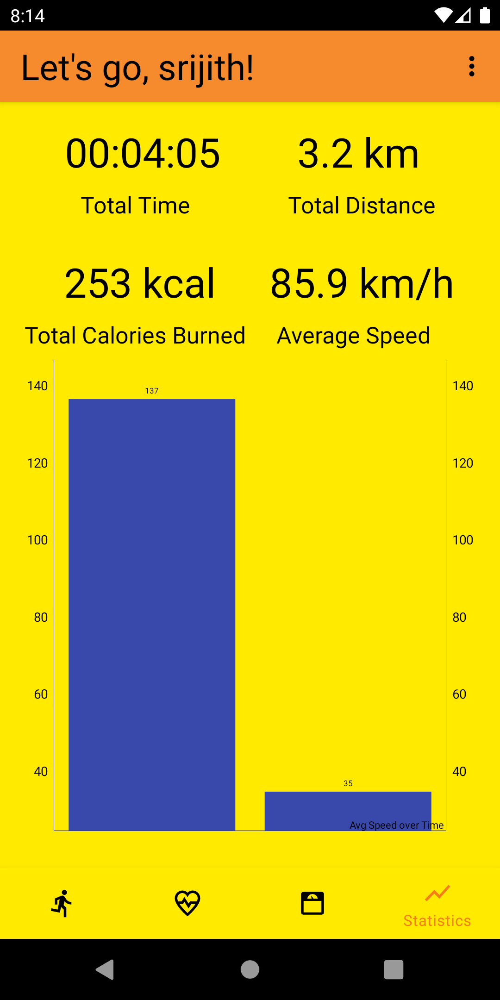

## Fitness Tracker

Fitness Tracker is a Material design client for Android which lets the user stay on track with his/her fitness goals. Fitness tracker uses Google Maps location services to track user runs.

Features:

* Users can track his/her runs which includes tracking calories burnt, speed, distance, map of the run track.
* Users can calculate his/her BMR and BMI to stay on track with their fitness goals.
* Users can view stats, which includes total distance, total calories burnt, average speed, total time spent.
* Users can track their runs while the app is in background. Users can pause/resume the tracking without having to open the app.

### Setup
**Requirements**
- Latest Android SDK tools
- Latest Android platform tools
- Android SDK 29
- AndroidX

**Running the app**
- Download/clone the project
- Get the Google api key for [Google Maps SDK]
- Place the key under [strings.xml]
- You are all set, start running the app.

### Screenshots

### References
- https://www.bmi-calculator.net
- https://www.seacoastonline.com/article/20070412/ENTERTAIN/704120346

[Google Maps SDK]: https://developers.google.com/maps/documentation/android-sdk/get-api-key
[strings.xml]:https://github.com/srijith1979/FitnessTracker/blob/master/app/src/main/res/values/strings.xml#L10
